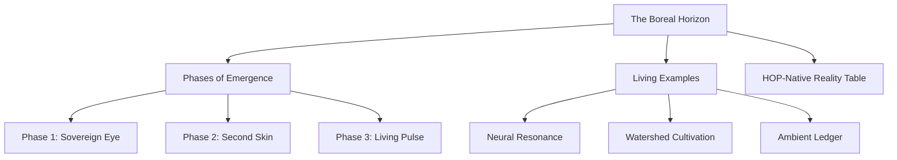

# Plan: Boreal Horizon - The Nature of Computation

## Overview
This plan outlines the implementation of a new section in the HealthScience website titled "The Boreal Horizon: The Nature of Computation". The section will be implemented as a standalone Vue component to maintain modularity and clean code structure.

## Component Architecture: `BorealComputation.vue`

### 1. Visual Aesthetic
- **Theme**: "Biological High-Tech" / "Organic Cybernetics".
- **Colors**: Deep forest greens (`--forest-void`), neon accents (`--neon-pulse`), and soft organic borders (`--pine-border`).
- **Typography**: Clean sans-serif for body, monospace for technical labels/phases.

### 2. Section Breakdown

#### I. Introduction (The Boreal Horizon)
- Large, elegant heading.
- Lead paragraph with high-contrast text to establish the "Resonant, Living State" concept.

#### II. The Phases of Emergence (Grid/Timeline)
- **Phase 1: The Sovereign Eye**: Focus on "Alignment" and "Sensing".
- **Phase 2: The Second Skin**: Focus on "Conformity" and "Molecular Assembly".
- **Phase 3: The Living Pulse**: Focus on "Synthesis" and "Organic Electronics".
- *Visual*: A horizontal or vertical flow using `border-l` or `border-t` with neon pulse indicators.

#### III. Living Examples (Bento-style Cards)
- **Direct Neural Resonance**: Card with focus on "Truth" and "Vagus Nerve".
- **Watershed Cultivation**: Card with focus on "Bioregional" and "On-demand".
- **The Ambient Ledger**: Card with focus on "Rhythm" and "Planetary Coherence".

#### IV. The HOP-Native Reality (Comparison Table)
- A sleek, minimalist table comparing "The Path Forward" with "Resonance-Based Creation".
- Use `grid-cols-2` for a modern, responsive table feel.

## Implementation Steps

1.  **Create `components/BorealComputation.vue`**:
    - Define the template structure using Tailwind CSS and existing project variables.
    - Use `lego-module` class for consistency where appropriate.
2.  **Integrate into `app.vue`**:
    - Import the component.
    - Replace the placeholder `<section>` at lines 278-281 with `<BorealComputation />`.
3.  **Refine Styles**:
    - Ensure the "Boreal" section feels distinct yet part of the overall "HealthScience" ecosystem.
    - Add subtle animations (e.g., fade-in on scroll).

## Mermaid Diagram: Content Flow

---
*Note: This plan focuses on a high-fidelity implementation of the provided text, ensuring it matches the sophisticated, biological-technical tone of the project.*
