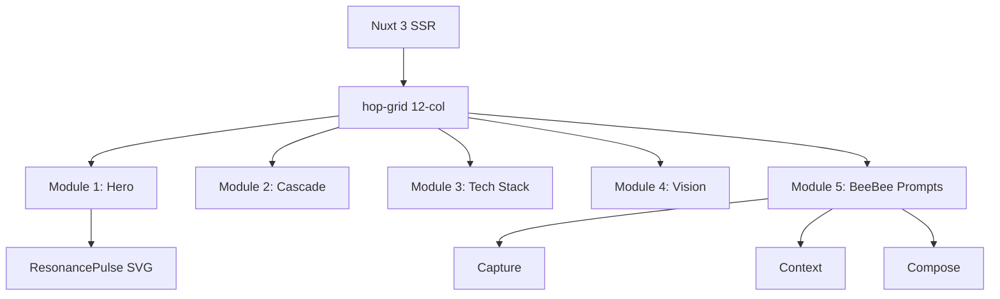

# Project Plan: healthscience.network

## 1. Identity & Aesthetic
- **Core Truth:** "Gaia intelligences shape health."
- **Aesthetic:** "Grounded Sci-Fi" (Woodland research lab).
- **Palette:** 
  - Deep Forest: `#0a0f0d`
  - Neon Pulse: `#a9ff00`
  - Tactical Pine: `#2d4635`
  - Grid Border: `#1a241e`

## 2. Technical Architecture
- **Framework:** Nuxt 3 (SSR).
- **Language:** JavaScript (No TypeScript).  CSS grid only
- **Layout:** 12-column CSS Grid (`.hop-grid`).
- **Components:** Self-contained "Lego" modules.  Lego and modularity of HOP reflected in web design
- **Visuals:** Raw SVG/Canvas (No 3rd-party chart libs).

## 3. Module Breakdown

### Module 1: Hero (The Gaia Pulse)
- **Headline:** "Gaia intelligences shape health."
- **Sub-headline:** "A Biological Navigation System for Sovereign Health."
- **Interactive:** `ResonancePulse` SVG component.
  - Logic: Wave coherence shifts based on `new Date().getHours()`.

### Module 2: The How It Works (The Cascade)
- **Structure:** 4-part vertical or horizontal cascade.
- **Content:**
  - **Cellular:** SafeFlow-ECS State Machine.
  - **Human:** Besearch & Von Mises Emulations.
  - **Bioregional:** Peer-to-Peer DML.
  - **Gaia:** The Protocol of Coherence.

### Module 3: The Technical Stack (Stern Merits)
- **UI:** Tactical cards with minimal borders.
- **Items:** SafeFlow-ECS, RGB Cryptography, BeeBee Agents, DML.

### Module 4: The Post-Monetary Vision
- **Concept:** "Proof of Coherence."
- **Copy:** Focus on individual resonance as a service to the network.

### Module 5: Interaction (BeeBee Prompts)
- **Feature:** Contact/Join section using a 3-step prompt flow.
- **Steps:** Capture (Bioregion) -> Context (HeliClock) -> Compose (Lego Contract).

## 4. Implementation Strategy
1. **Cleanup:** Remove all existing files in `src/`, `public/`, and root config files.
2. **Initialization:** Install `nuxt` and setup `nuxt.config.js`.
3. **Base Styles:** Define the 12-column grid and global forest theme.
4. **Component Development:** Build modules as independent Vue components.
5. **Animation:** Implement "Mechanical Snaps" using CSS scroll-snap or Intersection Observer for entry transitions.

## 5. System Diagram

