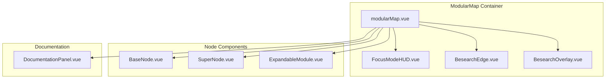
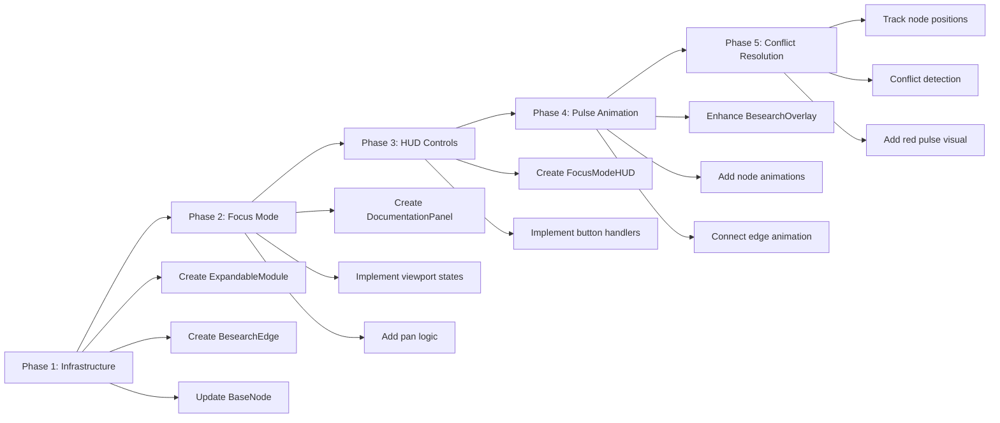

# Plan: Technical Modular Map Upgrade - Focus Mode & Besearch Pulse

This plan outlines the upgrade of the existing [`modularMap.vue`](components/technical/modularMap.vue) to implement the "Focus Mode" UI and the "Besearch Pulse" Animation as specified in `kilo-ui-focus-mode-spec.md`.

## 1. Gap Analysis

### Currently Implemented
- [x] Vue Flow canvas with custom BaseNode and SuperNode components
- [x] Explorer/Playground view switcher
- [x] BesearchOverlay with 4-stage pulse visualization (text-only)
- [x] Node selection with side-car panel (right-side drawer)
- [x] Coupling highlight on hover
- [x] Basic node styling with layer colors

### Required but Missing
- [ ] **Semantic Zoom Levels**: Macro (0.5x), Micro (1.0x), Focus (selected node)
- [ ] **ExpandableModule.vue**: Dynamic node expansion with reactive scaling
- [ ] **BesearchEdge.vue**: Animated SVG edge with stroke-dashoffset for pathing
- [ ] **Focus Mode Layout**: Map shifts to left: 40vw, DocumentationPanel at 60vw
- [ ] **Enhanced Besearch Pulse**: Node-specific animations (Cyan Ripple, Neural Jitter, Bone White flash)
- [ ] **HUD (Heads-Up Display)**: Fixed bottom-right controls
- [ ] **Conflict Resolution Visual**: Red pulse between competing Super-Nodes

---

## 2. Architecture Overview



---

## 3. Component Specifications

### 3.1 ExpandableModule.vue (New)

Replaces BaseNode when node is active or focused.

```javascript
// Props for Kilo to implement
props: {
  id: String,
  data: Object, // { title, logic, snippet, cluster }
  isActive: Boolean // Controlled by the 'Besearch Pulse' sequence
}

// Logic: Reactive Scaling
const nodeStyle = computed(() => ({
  width: isActive ? '500px' : '220px',
  zIndex: isActive ? 100 : 1,
  transition: 'all 0.5s cubic-bezier(0.4, 0, 0.2, 1)'
}));
```

**States**:
- **Default**: 220px width, shows label + brief logic
- **Active** (during Besearch Pulse): 500px width, full code snippet visible
- **Focused** (selected): Documentation panel slides in

### 3.2 BesearchEdge.vue (New)

Custom edge component with animated SVG path.

```javascript
// Props
props: {
  id: String,
  source: String,
  target: String,
  isRunning: Boolean // Triggered during Stage 2 (Pathing)
}

// Animation: stroke-dashoffset
// When isRunning: animate dash from 0 to full length
```

### 3.3 DocumentationPanel.vue (New)

Enhanced side panel with focus mode transition.

```css
/* Transition from current to Focus Mode */
.panel {
  width: 60vw; /* Focus mode */
  transform: translateX(0);
}

.map-container {
  width: 40vw; /* Focus mode */
  left: 0;
}
```

### 3.4 FocusModeHUD.vue (New)

Fixed overlay in bottom-right corner.

```html
<div class="fixed bottom-6 right-6 z-50 flex flex-col gap-3">
  <button class="hud-btn bg-amber-500/20 border-amber-500/50 text-amber-500">
    RUN BESEARCH
  </button>
  <button class="hud-btn bg-neon/20 border-neon/50 text-neon">
    SHOW COUPLING
  </button>
  <button class="hud-btn bg-pine/20 border-pine/50 text-pine">
    RESET VIEW
  </button>
</div>
```

---

## 4. The Besearch Pulse Animation Specification

### Stage 1: Origin (Cyan Ripple)
- **Target Nodes**: master-key, heli-clock
- **Animation**: CSS `@keyframes ripple` - concentric cyan circles emanating from node center
- **Duration**: 1500ms
- **Color**: `#00ffcc` (Cyan)

### Stage 2: Pathing (Animated Edge)
- **Target Edge**: master-key → library-storage, heli-clock → safeflow-ecs
- **Animation**: stroke-dashoffset animation drawing the line
- **Duration**: 1000ms
- **Easing**: ease-in-out

### Stage 3: Processing (Neural Jitter)
- **Target Node**: neat-hop
- **Animation**: Randomized micro-translations (translateX/Y jitter)
- **Duration**: 2000ms
- **Effect**: Node SVG elements shake randomly

### Stage 4: Commit (Bone White Flash)
- **Target Node**: coherence-ledger
- **Animation**: Flash solid Bone White (`#f5f5dc`), then return to steady pulse
- **Duration**: 1000ms flash
- **Final State**: Steady cyan pulse

---

## 5. Viewport State Logic

### Macro (0.5x Zoom)
- All nodes collapse to "Glow-Nodes"
- Hide code snippets and detail text
- Show only cluster labels: Foundation, Engine, Fabric

### Micro (1.0x Zoom)
- Individual nodes show Logic Profile and Title
- Standard node size (220px)

### Focus (Selected Node)
- Map shifts to left: 0; width: 40vw
- DocumentationPanel slides in from right (width: 60vw)
- Selected node expands to 500px
- Use `vueFlowInstance.setTransform` to pan camera away from sidebar

---

## 6. Conflict Resolution Visual

When user drags a second "Super-Node" into active workspace:

**Condition**: Two Super-Nodes share the same biological state in SafeFlow-ECS

**Visual**: Subtle red pulse between the two nodes
- Red glow (`#ef4444`) at 50% opacity
- Pulse animation at 1Hz
- Lasts until one node is moved away

---

## 7. Implementation Phases

### Phase 1: Core Infrastructure
- [ ] Create `ExpandableModule.vue` component
- [ ] Create `BesearchEdge.vue` edge component
- [ ] Update `BaseNode.vue` to support `isActive` prop and scaling
- [ ] Integrate custom edge type into Vue Flow

### Phase 2: Focus Mode Layout
- [ ] Create `DocumentationPanel.vue` with transition logic
- [ ] Update `modularMap.vue` to handle viewport state (Macro/Micro/Focus)
- [ ] Implement sidebar width transitions
- [ ] Add `setTransform` pan logic when panel opens

### Phase 3: HUD & Controls
- [ ] Create `FocusModeHUD.vue` component
- [ ] Implement "RUN BESEARCH" button logic
- [ ] Implement "SHOW COUPLING" toggle
- [ ] Implement "RESET VIEW" (fitView)

### Phase 4: Besearch Pulse Animation
- [ ] Update `BesearchOverlay.vue` with enhanced stage animations
- [ ] Add node-specific animations (Ripple, Jitter, Flash)
- [ ] Connect edge animation to Stage 2
- [ ] Test timing sequence (1-2-3-4 flow)

### Phase 5: Conflict Resolution
- [ ] Add Super-Node position tracking
- [ ] Implement biological state conflict detection
- [ ] Add red pulse visual between conflicting nodes

---

## 8. Dependencies & Technical Notes

### Vue Flow Configuration
```javascript
const { fitView, setTransform } = useVueFlow();

// Initialize
fitViewOnInit: true
minZoom: 0.2
maxZoom: 4

// Focus Mode transform
setTransform({ x: 400, y: 100, zoom: 1.0 })
```

### Typography
- Use JetBrains Mono for code snippets
- Ensure 16px+ legibility at 1.0x zoom
- Fallback: `font-mono` from Tailwind

### Tailwind Color Extensions
Ensure these colors are in tailwind.config.js:
- `neon`: `#00ffcc`
- `pine`: `#1a1a2e`
- `forest`: `#0f0f1a`
- `amber`: `#f59e0b`
- `bone`: `#f5f5dc`

---

## 9. File Changes Summary

| File | Action |
| :--- | :--- |
| `components/technical/ExpandableModule.vue` | **CREATE** - Dynamic node with scaling |
| `components/technical/BesearchEdge.vue` | **CREATE** - Animated edge component |
| `components/technical/DocumentationPanel.vue` | **CREATE** - Focus mode sidebar |
| `components/technical/FocusModeHUD.vue` | **CREATE** - HUD controls |
| `components/technical/BaseNode.vue` | **MODIFY** - Add `isActive` prop, scaling |
| `components/technical/BesearchOverlay.vue` | **MODIFY** - Enhanced animations |
| `components/technical/modularMap.vue` | **MODIFY** - Viewport states, HUD integration |
| `tailwind.config.js` | **MODIFY** - Add missing colors |

---

## 10. Mermaid: Implementation Workflow


