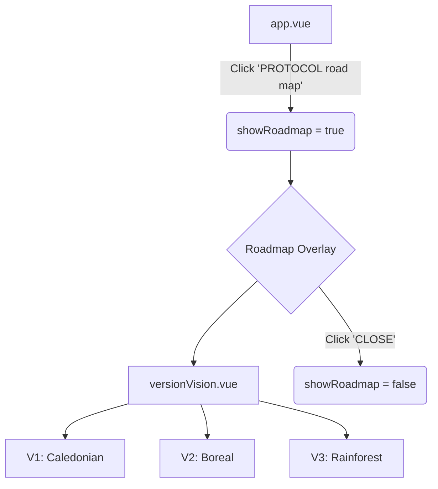

# Roadmap Implementation Plan

## Overview
The goal is to add a clickable "PROTOCOL road map" link in `app.vue` that opens a full-screen overlay displaying the roadmap content from `components/roadmap/versionVision.vue`.

## Component Design: `versionVision.vue`
- **Layout**: A three-column grid (or vertical stack on mobile) representing V1, V2, and V3.
- **Theme**: Consistent with the "forest/pine/neon" aesthetic.
- **Content**:
    - **V1: Caledonian (The Native Seed)**: Focus on Local-First Stability.
    - **V2: Boreal / Taiga (The Great Connection)**: Focus on bare.js & P2P.
    - **V3: Rainforest (The Abundant Intelligence)**: Focus on 3D Emulation & Decentralized ML.
- **Visuals**: Use cards with borders, mono-spaced tags, and clear headings.

## Integration in `app.vue`
1. **State**: Add `const showRoadmap = ref(false)`.
2. **Trigger**: Add a clickable element (button or link) near line 152 with the text "PROTOCOL road map".
3. **Overlay**: Add a `<Transition>` block containing the `versionVision.vue` component, similar to `PluginHOP` or `ResonAgentMaths`.

## Mermaid Diagram

## Proposed Todo List
1. [ ] Create `components/roadmap/versionVision.vue` with the roadmap content and layout.
2. [ ] Update `app.vue` to import `versionVision.vue`.
3. [ ] Add `showRoadmap` state to `app.vue`.
4. [ ] Add the "PROTOCOL road map" trigger to the template in `app.vue`.
5. [ ] Add the roadmap overlay transition to `app.vue`.
